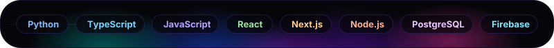
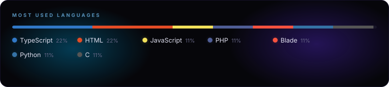
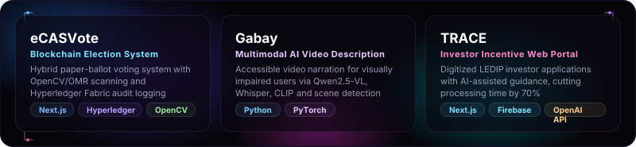

<picture>
  <source media="(prefers-color-scheme: dark)" srcset="./.github/assets/contribution-snake-dark.svg" />
  <source media="(prefers-color-scheme: light)" srcset="./.github/assets/contribution-snake.svg" />
  
</picture>

